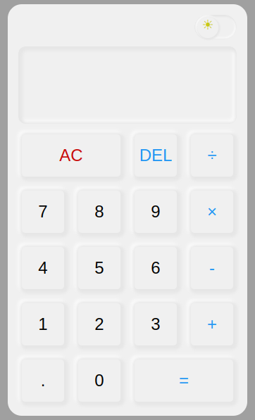

# Neumorphic Calculator

A Neumorphism effect calculator with light and dark mode, built using HTML, CSS, Javacript.

## Screenshots

### Light Theme



### Dark Theme


## Features

- Calculator
- Neumorphism effect
- Light and Dark theme

## Demo

Check out the live demo [here](https://guna81.github.io/neumorphic-calculator/).

## Clone the repository

```bash
git clone https://github.com/guna81/neumorphic-calculator.git
cd neumorphic-calculator
```
